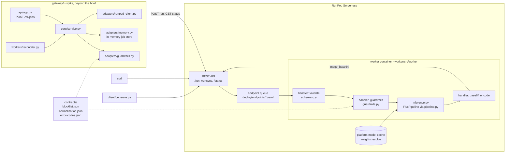
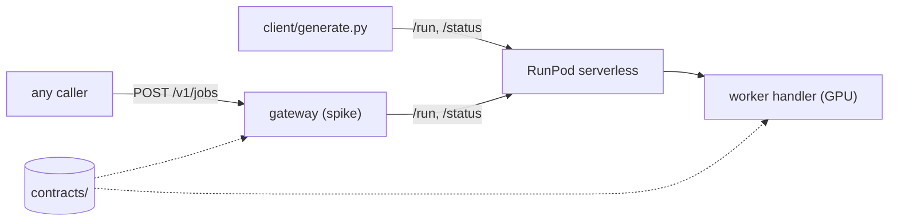
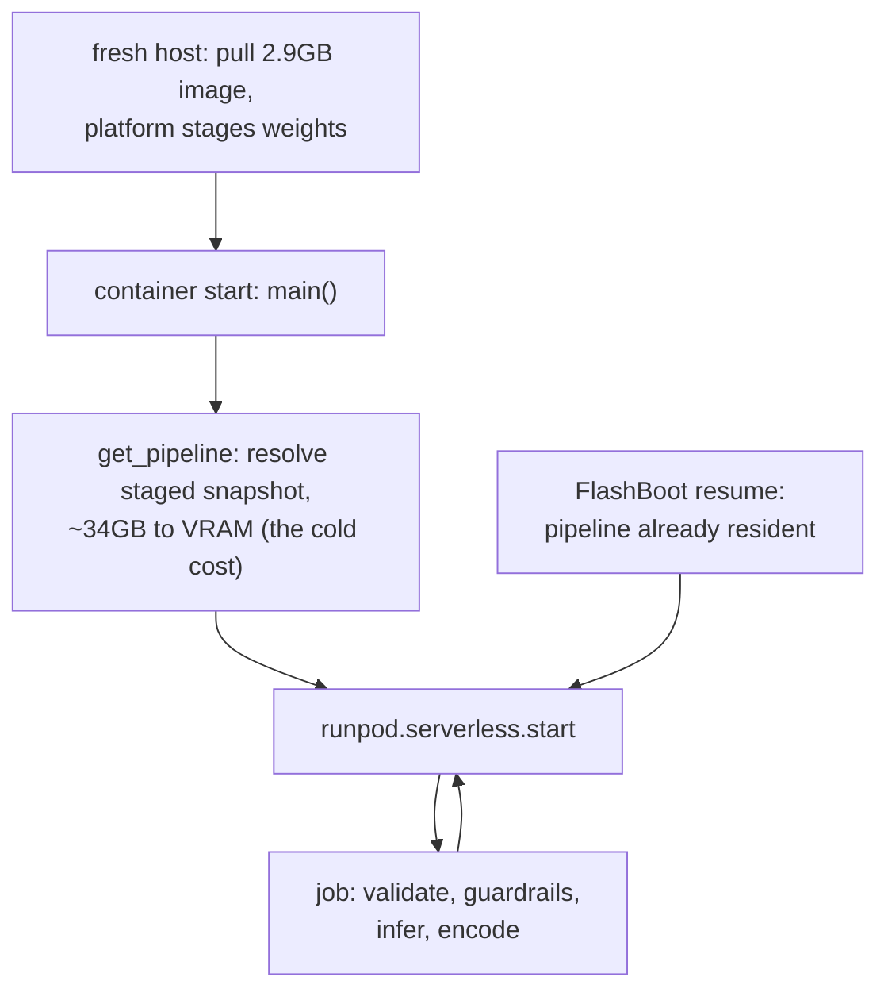
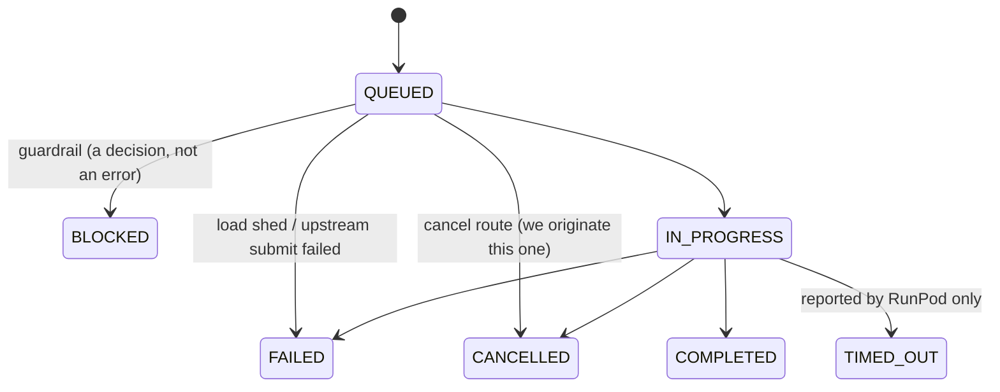
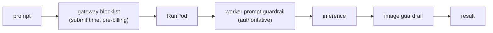
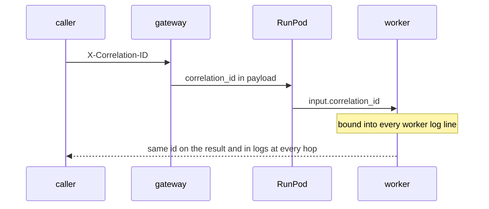
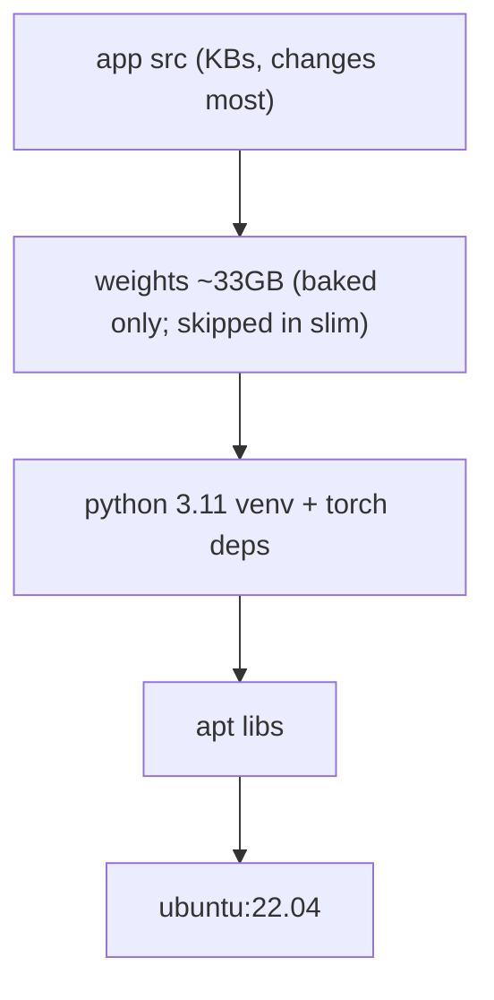

# FLUX.1-dev on RunPod Serverless

A serverless text-to-image endpoint running `black-forest-labs/FLUX.1-dev`, deployed on RunPod using cached models (the platform pre-stages the weights on host machines). The baked-weights image is a one-command build target (`make build-baked`), not deployed; see [Weight delivery](#weight-delivery).

> **Status:** live and verified 2026-08-06. Endpoint `<endpoint-id: supplied in the submission email>`, image `0.1.0-b8d1f76-slim` (deployed via `deploy.yml`), 48GB GPU tier, weights via RunPod's model store. 7/7 e2e cases pass against it; committed samples with seeds in [`samples/`](samples/); measured results in [`BENCHMARKS.md`](BENCHMARKS.md) (156 records, raw data committed).

[What's here](#whats-here) · [Call it](#call-it) · [Input](#input) · [Errors](#errors) · [Prerequisites](#prerequisites) · [Develop](#develop) · [Build and deploy](#build-and-deploy) · [Design](#design) · [Repository](#repository) · [Current state](#current-state) · [Author](#author) · [Licence](#licence)

## What's here

One deliverable and two spikes. The spikes sit beside the brief, not inside it: each is self-contained, carries its own README, and the endpoint is callable without either.

| Tier | Where | What it is |
|---|---|---|
| **The deliverable** | [`worker/`](worker/), [`worker/Dockerfile`](worker/Dockerfile), [`deploy/endpoints/`](deploy/endpoints/), [`scripts/apply_endpoint.py`](scripts/apply_endpoint.py), [`docs/RUNBOOK.md`](docs/RUNBOOK.md), [`samples/`](samples/), [`client/generate.py`](client/generate.py) | The brief: handler, image, deployed endpoint, demo client, operations. Request lifecycle and package details in [`worker/README.md`](worker/README.md) |
| **Spike: benchmarks** | [`benchmarks/`](benchmarks/), [`BENCHMARKS.md`](BENCHMARKS.md) | What the endpoint actually does under one variable at a time: steps, resolution, payload, concurrency, cold starts. Its rendered report backs every number quoted below. [`benchmarks/README.md`](benchmarks/README.md) |
| **Spike: gateway** | [`gateway/`](gateway/) | A production-shaped API tier in front of the endpoint: auth, idempotency, job store, reconciler. Endpoints, and the fence, in [`gateway/README.md`](gateway/README.md) |

The design record is [`docs/DESIGN.md`](docs/DESIGN.md). Engineering conventions in [`STANDARDS.md`](STANDARDS.md). That file doubles as the working guide for the agentic coding process used to build this repo, so it spells out rules a human reviewer would take as given.

## Call it

One command against a warm worker, prompt in, image out:

```bash
export RUNPOD_API_KEY=...        # your RunPod key
export RUNPOD_ENDPOINT_ID=...    # the deployed endpoint

curl -s -X POST "https://api.runpod.ai/v2/$RUNPOD_ENDPOINT_ID/runsync" \
  -H "Authorization: Bearer $RUNPOD_API_KEY" \
  -H "Content-Type: application/json" \
  -d '{"input": {"prompt": "a red fox in falling snow, cinematic lighting"}}' \
  | jq -r '.output.image_base64' | base64 -d > fox.png
```

`/runsync` holds the connection and returns the finished output:

- Warm job: ~22s at the defaults, ~1.7MB of base64 (measured, N=10, `BENCHMARKS.md`), one call.
- Cold worker: longer than the hold. ~16s p50 when FlashBoot resumes an idle worker (N=3); up to minutes when staging lands on a fresh host (measured true-cold p50 89.9s, max 518.1s, N=3).
- Warm the endpoint with one throwaway request before demonstrating.

Every percentile here and in `BENCHMARKS.md` comes from a small fixed-seed sample (N is 3-10 per cell, sequential probes). They rank options; they are not latency guarantees. SLO-grade p50/p95 needs a load test (e.g. Locust) at production concurrency, which has not been run.

For anything real, submit and poll. That is what the client does, with live progress and observed wall time:

```bash
pip install -r client/requirements.txt      # RunPod's official SDK
python client/generate.py "a red fox in falling snow" --out fox.png
# job 7f3a-...
#   IN_QUEUE
#   IN_PROGRESS
#   COMPLETED
# saved fox.png  seed=918273  1024x1024  inference=21.4s  observed=24.8s
```

The client uses `runpod.Endpoint` rather than raw HTTP: the SDK owns the
polling loop, the `{"input": ...}` envelope and the retry semantics, so ~15
lines replace ~150. The same operations by hand:

```bash
curl -s -X POST "https://api.runpod.ai/v2/$RUNPOD_ENDPOINT_ID/run" \
  -H "Authorization: Bearer $RUNPOD_API_KEY" \
  -H "Content-Type: application/json" \
  -d '{"input": {"prompt": "a red fox in falling snow"}}'
# -> {"id": "abc-123", "status": "IN_QUEUE"}

curl -s "https://api.runpod.ai/v2/$RUNPOD_ENDPOINT_ID/status/abc-123" \
  -H "Authorization: Bearer $RUNPOD_API_KEY"
```

**Results expire.** RunPod retains a finished job's output for **30 minutes**
after `/run`, and **1 minute** after `/runsync`. Anything polling (the client,
the gateway reconciler) must fetch inside that window; afterwards `/status`
has nothing left to return.

`GET /status/{id}` returns the handler's output verbatim, so the completed response carries the image inline:

```json
{
  "status": "COMPLETED",
  "output": {
    "image_base64": "iVBORw0KGgo...",
    "format": "png",
    "seed": 918273,
    "width": 1024,
    "height": 1024,
    "num_inference_steps": 28,
    "guidance_scale": 3.5,
    "model_version": "black-forest-labs/FLUX.1-dev@<revision>",
    "timings": {"inference_s": 21.4, "encode_s": 0.3}
  }
}
```

While a job runs, `status` polls return progress, throttled to ~10% strides
(each report costs a platform round trip, so per-step updates would tax the
GPU loop for nothing):

```json
{"status": "IN_PROGRESS", "output": {"step": 12, "total": 28, "percent": 43}}
```

## Input

Only `prompt` is required.

| Field | Type | Default | Range |
|---|---|---|---|
| `prompt` | string | - | 1-2000 chars, non-blank |
| `width` | int | 1024 | 256-1536, snapped down to ×16 |
| `height` | int | 1024 | 256-1536, snapped down to ×16 |
| `num_inference_steps` | int | 28 | 1-50 |
| `guidance_scale` | float | 3.5 | 0-20 |
| `seed` | int \| null | random | 0-2³¹−1, always echoed back |
| `output_format` | `"png"` \| `"jpeg"` | `"png"` | - |
| `correlation_id` | string \| null | null | bound into worker logs |

**No negative prompt.** FLUX.1-dev is guidance-distilled: it runs one forward pass per step with guidance as an embedding input. Real classifier-free guidance (`true_cfg_scale > 1`) restores negative prompts but runs a second pass per step (roughly double the latency and cost) while adding a second guidance control that interacts with the distilled one, for no reliable quality gain.

**Dimensions snap down** to a multiple of 16, because FLUX latents are 16× downsampled. The effective values are returned, so a request for 1000px reports 992.

**The seed is always returned**, including when randomly chosen, so every image is reproducible.

## Errors

A rejected or failed job reports `"status": "FAILED"`, and the structured envelope arrives **JSON-encoded inside the platform's `error` string**. Decode it to get code, message and suggestion:

```json
{"status": "FAILED",
 "error": "{\"code\": \"PROMPT_BLOCKED\", \"message\": \"Prompt matched a blocked term.\", \"suggestion\": \"Rephrase the prompt and resubmit.\"}"}
```

The encoding is forced by the platform: RunPod carries a job's error only as a string, and a dict returned there is silently dropped, leaving the caller a completed job with no output at all. Found by the e2e suite against the live endpoint; the string round-trip preserves the envelope for humans and agents alike.

| Code | Meaning |
|---|---|
| `INVALID_PROMPT` | Blank, or over 2000 characters |
| `INVALID_DIMENSIONS` | Outside 256-1536 |
| `INVALID_STEPS` | Outside 1-50 |
| `PROMPT_BLOCKED` | Rejected by the prompt guardrail. A policy verdict; retry only after changing the prompt |
| `IMAGE_BLOCKED` | Rejected by the image guardrail. A policy verdict; retry only after changing the prompt or seed |
| `OOM` | VRAM exhausted; the worker is retired via `refresh_worker` |
| `INFERENCE_FAILED` | Unclassified pipeline failure, **or** a guardrail that crashed. The request still fails closed, but a crash is an infra fault and retryable as-is, so it is never reported as a block |

Every error carries a `suggestion` naming the next valid action, because callers include agents that cannot infer recovery from prose.

## Prerequisites

| Tool | Version | Needed for |
|---|---|---|
| [uv](https://docs.astral.sh/uv/) | any | every `make` target; it provisions the interpreter |
| Python | 3.11 (`requires-python = ">=3.11,<3.12"`, both packages) | installed by `uv sync`, no system Python required |
| `make` | any | the targets below |
| Docker with buildx | any | `make build-slim`, `make build-baked`, the compose stack |
| `curl`, `jq`, `base64` | any | the copy-paste call above |
| RunPod account and API key | - | calling the endpoint, deploying, the e2e suite |
| `HF_TOKEN`, FLUX.1-dev licence accepted | - | `make weights-check`, `make build-baked` |

`make check` needs the first three rows only.

## Develop

```bash
git clone https://github.com/andyozj/test-runpod.git && cd test-runpod
make install       # sync both package environments
make check         # format, lint, types, imports, tests + coverage gate
make doctest       # the executable examples
make weights-check # verify the weight filter against HF. Downloads nothing.
```

Every variable either settings module reads is in [`.env.example`](.env.example), with its default and what happens when it is unset. Copy it to `.env`; `.env` is git-ignored. Calling the live endpoint needs two of them: `RUNPOD_API_KEY` and `RUNPOD_ENDPOINT_ID`.

Workflow, gates and review expectations in [`CONTRIBUTING.md`](CONTRIBUTING.md).

The e2e suite is deselected by default and runs against the live endpoint:

```bash
cd worker && RUNPOD_API_KEY=... RUNPOD_ENDPOINT_ID=... uv run pytest -m gpu tests/e2e
```

CI runs the same gates as `make check` (both packages, the import-linter
layering contract, the CLI-tool lint) plus the doctests. **No unit or
integration test requires a GPU, model weights, or an external network
service.** That is a design constraint, not a preference: it forces the
pipeline behind an injectable accessor rather than a module-level global.

## Build and deploy

The deployed image is ~2.9GB: no weights, and no CUDA base image, since the torch wheel carries its own libraries. **Build it locally**; there is no Pod in the procedure. Full steps in [`docs/RUNBOOK.md`](docs/RUNBOOK.md).

```bash
make build-slim       # tags ghcr.io/andyozj/flux-worker:<version>-<sha>-slim
docker push ghcr.io/andyozj/flux-worker:$(make -s print-tag)-slim
```

Versioning is tag-driven: the most recent `v*` git tag names the version, the commit SHA makes the image tag immutable, and `make print-tag` shows the result. Override `IMAGE`/`TAG` on the command line for another registry. `--platform linux/amd64` is set in the Makefile; without it an arm64 build produces an image RunPod cannot run (symptoms in the [RUNBOOK](docs/RUNBOOK.md#diagnosis)).

CD: `.github/workflows/deploy.yml` runs CI, builds, pushes and applies from one button (rollback = re-run with the previous tag); a `v*` tag push publishes the image without deploying. Details in the [RUNBOOK](docs/RUNBOOK.md). When something is broken, start at its [Diagnosis](docs/RUNBOOK.md#diagnosis) table: symptom, likely cause, the check that settles it, ordered by how often each is actually the cause.

### Weight delivery

The brief says *"Build a Docker image that includes your serverless handler and the model."* That is the baked image, and it exists in this repo for that reason alone: `make build-baked` produces it on demand (both variants build from one `Dockerfile` via `BAKE_WEIGHTS`). It is not deployed, and outside this brief it would not be built at all. Baking ~34GB of weights into a container buys the slowest scale-up, a 30-60 min build-push cycle, and registry-cap trouble, for nothing the platform cannot deliver better separately.

The production decision rule:

1. **Model hosted on HuggingFace: cached models.** RunPod's model store stages from HF and pre-loads the weights on host machines before a worker starts. FLUX.1-dev is on HF, so this is what is deployed.
2. **Model not on HF (private or custom weights): network volume.** Cached models stage from HF only, so a volume becomes the delivery mechanism, and its costs (datacenter pin, per-GB bill, population step) are accepted rather than chosen.
3. **Baked image: brief compliance, not a proven fallback.** It has never been pushed or deployed. In principle it is the only fallback buildable *before* an incident; in practice the push is broken as written: the weights land in a single ~33GB layer and GHCR's documented limit is 10GB per layer, so pushing requires first splitting the weights across multiple image layers. CI cannot build it at all (14GB runner disk). Until a 45GB push is demonstrated, the honest recovery path for a cached-staging outage is populating a network volume (~1h of Pod time) despite its costs.

| | Baked (~45GB) | **Cached (~2.9GB)** |
|---|---|---|
| Fresh-worker scale-up | Pull 45GB | Pull 2.9GB; host already holds the model |
| Build and push | Never attempted, and not pushable as written: one ~33GB weights layer vs GHCR's 10GB-per-layer limit | Minutes |
| Storage cost | Registry only | **None** |
| Weight transfer | Billed at build | **Unbilled, pre-staged** |
| Maturity | Stable | **Shipped 2026-08**, no beta label; limits: one model per endpoint, all quantizations stage together |

A deliberate deviation, stated rather than hidden. Staging pulls the whole repo, so the ~24GB of duplicate single-file weights come along: unbilled, and not our disk.

**For this model, a network volume was tried and dropped.** FLUX.1-dev is on HF, so the volume competed with cached models and lost: it costs a datacenter pin that narrows the GPU pool exactly when scaling up under load, plus a per-GB bill and a population step. It is not kept as a *standing* fallback: a volume is only a fallback if it is *already populated*. But no fallback here is exercised; if cached staging ever breaks, populating a volume is the recovery path that is known to work, while the baked push is not (rule 3). For weights that are not on HF, rule 2 above applies and the volume stops being a choice.

`weights.resolve()` tries the configured path, then the model cache, so a deployment picks a mechanism by configuration alone. The staged snapshot is identified through the cache's `refs/main`, and the revision it actually holds is reported on every result; the worker refuses to start only when several snapshots coexist with no ref naming the staged one. RunPod's own example picks an arbitrary snapshot in that case, which would misattribute every image.

The deployed (cached) variant is what [`BENCHMARKS.md`](BENCHMARKS.md) measures; the baked variant is a one-command build target, never built, pushed, or deployed here, so it carries no numbers.

Two details that will otherwise cost you an hour each:

- **`HF_TOKEN` is a BuildKit secret, never an `ARG`.** An `ARG`-passed token is recoverable from image history by anyone who pulls the image.
- **The repo ships duplicate weights.** It contains both the `diffusers` sharded layout *and* the standalone `flux1-dev.safetensors` (23.8GB) plus `ae.safetensors`. A naive `snapshot_download` pulls ~56GB instead of ~33GB. `make weights-check` proves the filter works without downloading anything.

## Design

The delivered system is caller → RunPod → worker; the gateway box is a spike beyond the brief, and `contracts/` is what binds the two tiers.



| | |
|---|---|
| Model | FLUX.1-dev, bf16, unquantized. The loaded revision is discovered from the staged snapshot and reported on every result; cached models offer no revision control, so it is a reported fact, not a pin |
| Inference | `diffusers.FluxPipeline`. No `torch.compile`: 3-10 min of compilation on every cold start is net slower for serverless traffic |
| Weights | **Cached models** (deployed; the model is on HF). Volume only for non-HF weights; baked kept for the brief and as the pre-buildable fallback, see *Weight delivery* above |
| GPU | 48GB tier. This worker keeps everything resident in bf16 (~34GB: 23.8GB transformer + ~9.5GB T5-XXL) for the fastest warm latency; under *that* policy 48GB is the floor. Smaller cards run FLUX fine with CPU offload (~27GB peak, fits 40GB) or fp8 quantization (fits 24GB), trading seconds per job for VRAM |
| Concurrency | `concurrency_modifier = 1`. The worker is GPU-bound; a second concurrent job causes VRAM contention, not throughput |

Decisions and their trade-offs, including the options rejected and what is deliberately *not* built, are in [`docs/DESIGN.md`](docs/DESIGN.md). Operational procedure is in [`docs/RUNBOOK.md`](docs/RUNBOOK.md).

### Diagrams

**System context.** Two tiers, one direction of dependency: nothing in the worker knows the gateway exists.



**Worker lifecycle.** Cold start vs warm, and why the pipeline loads in `main()` rather than at import: the first billed job runs against a warm pipeline.



**Job state machine.** Terminal states are written once, never reversed; the reconciler only ever advances a job.



**Guardrail chain.** Two prompt checkpoints, both reading `contracts/blocklist.json`: the gateway rejects before a GPU spins, the worker enforces even for callers that never pass through the gateway.



**Correlation.** One id from HTTP through the GPU and back.



**Image layers.** Weights sit below application code, so a code change re-pushes kilobytes, never 33GB.



## Repository

```
contracts/           shared source of truth for both tiers
worker/              the serverless worker: the graded deliverable (worker/README.md)
  src/worker/        handler, pipeline, inference, guardrails, schemas
  scripts/           fetch_weights.py
  Dockerfile
client/generate.py   demo client, on RunPod's Python SDK
BENCHMARKS.md        measured results: rendered, never hand-written
benchmarks/          spike: harness.py, config.json, raw.jsonl (the evidence)
samples/             committed generations with their seeds
gateway/             spike: FastAPI tier beyond the brief (gateway/README.md)
deploy/endpoints/    endpoint configuration as code
scripts/             apply_endpoint.py
docs/RUNBOOK.md      build, deploy, rollback, diagnosis
docs/DESIGN.md       the design record: decisions and trade-offs
STANDARDS.md         engineering conventions; guide for the agentic workflow
CONTRIBUTING.md      workflow, gates, review expectations
SECURITY.md          reporting a vulnerability
.env.example         every variable either settings module reads
```

## Current state

| | |
|---|---|
| Endpoint | **Live** since 2026-08-06; 7/7 e2e cases pass, three samples committed with seeds |
| Image | `ghcr.io/andyozj/flux-worker:0.1.0-b8d1f76-slim`, 2.9GB, public, no secrets in any layer |
| Worker | 97 unit tests (no GPU required) + 7 e2e against the live endpoint |
| `BENCHMARKS.md` | Measured 2026-08-06; 156 records incl. an A100 cross-tier run, raw JSONL committed, methodology in its own header |
| Gateway | Spike, beyond the brief: core, async API, reconciler, 240 tests; containerised and in CI alongside the worker |

## Author

Andy Ong — [github.com/andyozj](https://github.com/andyozj)

## Licence

FLUX.1-dev is released under a non-commercial licence. Fine for evaluation; commercial use requires FLUX.1-schnell (Apache-2.0) or a commercial licence from Black Forest Labs.
