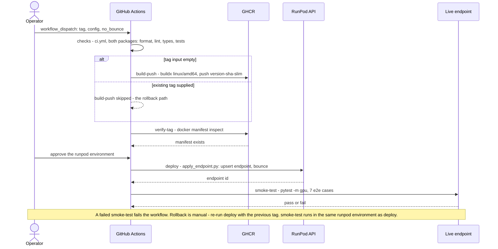

# Runbook

Operational procedures. Written to be followed under time pressure by someone who did not write them.

Procedures: [Prerequisites](#prerequisites) · [Build and push](#build-and-push) · [Deploy](#deploy) · [Verify](#verify) · [Stack pod](#stack-pod-the-full-application) · [Rollback](#rollback) · [Diagnosis](#diagnosis) · [Teardown](#teardown).
Records (evidence, not procedure): [Deploy record](#deploy-record-evidence) · [Compose surface checks](#record-compose-surface-checks-2026-08-06).

## Deploy record (evidence)

A record, not a procedure. Update on every deploy. **A rollback that begins with "work out which tag was good" is not a rollback.**

| Date | Endpoint | Tag | Previous (rollback target) | Notes |
|---|---|---|---|---|
| 2026-08-06 | `flux-worker-cached` (`<endpoint-id, supplied in the submission email>`) | `0.1.0-44c9643-slim` | - (first deploy) | Image digest `bfc09415c350`. Cached model + HF token set in console post-create |
| 2026-08-06 | `flux-worker-cached` (`<endpoint-id, supplied in the submission email>`) | `0.1.0-72e537d-slim` | `0.1.0-44c9643-slim` | Error envelopes JSON-encoded; GPU list narrowed to L40S only. 7/7 e2e green post-roll |
| 2026-08-06 | `flux-worker-cached` (`<endpoint-id, supplied in the submission email>`) | `0.1.0-b8d1f76-slim` | `0.1.0-72e537d-slim` | First deploy through `deploy.yml` (CI gates → GHCR → environment approval → apply). Ships revision discovery: `model_version` reports the staged snapshot's SHA; the pin is gone. 7/7 e2e green post-roll (143s incl. cold start) |
| 2026-08-10 | `flux-worker-cached` (`<endpoint-id, supplied in the submission email>`) | `0.1.0-50c27c4-slim` | `0.1.0-b8d1f76-slim` | Ships latent preview streaming. First deploy through REST v2 by hand; both faults it exposed are fixed in `scripts/apply_endpoint.py` (`964fe44`). Preview frames confirmed on the wire: 4 `IN_PROGRESS` payloads, 1037-1768 JPEG bytes, shrinking as the latent denoises. Cold start 182.8s, warm 4.4s. 7/7 e2e green post-roll (123s) |

## Limits

What this runbook does not cover, so nobody looks for it at 3am:

- **No automatic rollback.** `smoke-test` in `deploy.yml` runs *after* `deploy` has already mutated the endpoint. A red smoke test is detection; the rollback is a human re-running the workflow with the previous tag from the record above.
- **One endpoint, in place.** `deploy/endpoints/cached.yaml` is the deployed config; `baked.yaml` is documented, not deployed. No blue/green, no canary, no traffic split — an apply replaces the running configuration and bounces the workers.
- **Two deploy paths, two workflows.** `deploy.yml` deploys the worker endpoint only. The gateway (with frontend and Postgres) deploys as the [stack pod](#stack-pod-the-full-application) through `deploy-stack.yml`; `compose.yaml` remains the local mirror.
- **No alerting.** Failures are found by running the checks below. Cold-start failures emit nothing at all (see [What is visible from where](#what-is-visible-from-where)).
- **Secrets are rotated by hand.** The complete list of what exists and where it is read: `.env.example` (every variable either settings module reads, plus build-time and compose passthroughs), and the two GitHub repo secrets `RUNPOD_API_KEY` and `RUNPOD_ENDPOINT_ID`. Teardown revocation steps are at the bottom.

## Prerequisites

| Requirement | Verify with |
|---|---|
| FLUX.1-dev licence accepted, `HF_TOKEN` set | `make weights-check` lists files rather than 403 |
| RunPod credits | Console billing page |
| GHCR write access | `echo $GHCR_TOKEN \| docker login ghcr.io -u $GHCR_USER --password-stdin` |
| Docker with buildx | `docker buildx version` |

`GHCR_USER` and `GHCR_TOKEN` are listed in `.env.example`; neither app reads them, they are build-and-push credentials only. The GHCR token must be a **classic** PAT with `write:packages`. Fine-grained tokens have no packages scope and fail login: the permissions dropdown lacks the entry, so the failure reads as looking in the wrong place, not as the wrong token type (2026-08-06, cost 1 hour).

`make weights-check` proves both build-blockers at once: the gated repo is reachable, and the ~24GB of duplicate single-file weights are excluded. Downloads nothing.

## Build and push

**Build locally.** The image is ~2.9GB: no weights, no CUDA base image ([`DESIGN.md`](DESIGN.md) §2). No Pod in this procedure: the baked variant would need one for its 45GB, the slim build does not.

**Versioning:** the most recent `v*` git tag names the version; the commit SHA makes the image tag immutable. `make build-slim` derives both: `v0.1.0` at `abc1234` builds `0.1.0-abc1234-slim`. Bump by tagging: `git tag -a v0.2.0 -m "..." && git push --tags`.

1. Derive the tag, then build. `IMAGE` and `TAG` are Makefile variables; override on the command line for another registry or an explicit version.

   ```bash
   export TAG=$(make -s print-tag)            # e.g. 0.1.0-abc1234
   export IMAGE=ghcr.io/andyozj/flux-worker
   make build-slim
   ```

   Success: `docker images $IMAGE:$TAG-slim` lists it at ~2.9GB.

2. Confirm the architecture.

   ```bash
   docker inspect $IMAGE:$TAG-slim --format '{{.Architecture}}'
   ```

   Must print `amd64`. `--platform linux/amd64` is set in the Makefile. Building on an arm64 Mac without it produces an image RunPod cannot run, and the failure presents as a worker that starts and immediately dies.

3. Smoke-test the image before it costs anything.

   ```bash
   docker run --rm --platform linux/amd64 $IMAGE:$TAG-slim \
     python -c "import torch, diffusers, worker.handler; print('imports ok')"
   ```

   Success: `imports ok`. Without a GPU that is as far as it goes locally. It catches a broken install, the wrong interpreter, and an architecture mismatch: three failures that would otherwise appear as a dead worker on a paid endpoint.

4. Push.

   ```bash
   docker buildx build --platform linux/amd64 --provenance=false \
     --build-arg BAKE_WEIGHTS=false -f worker/Dockerfile \
     -t $IMAGE:$TAG-slim --push .
   ```

   Success: the final line reads `pushing manifest for ghcr.io/...`. Confirm with `docker manifest inspect $IMAGE:$TAG-slim` — the media type must be `application/vnd.docker.distribution.manifest.v2+json`.

   **Not `docker push` after `make build-slim`.** With Docker's containerd image store that build produces an OCI index carrying an `unknown/unknown` attestation manifest, and the registry rejects it: the layers upload, then the manifest fails with `does not provide any platform` and nothing lands. Measured 2026-08-10. The buildx line above is the same build, pushed directly, and re-runs from cache in seconds. `deploy.yml` already builds this way, so CI was never affected.

   A first push creates the GHCR package **private**, and RunPod cannot pull it. Make it public (package settings → change visibility) or register a pull credential; the worker package is public.

The image also ships `test_input.json`, so on a GPU host `docker run --rm --gpus all $IMAGE:$TAG-slim` runs one real job end to end through the same `handler` the endpoint calls. First thing to try if the endpoint misbehaves.

## Deploy

Configuration lives in `deploy/endpoints/*.yaml` and is applied through RunPod's REST API v2 (`api.runpod.io/v2`). v1 split a deploy into a template plus an endpoint; v2 folds image, environment, GPUs, scaling and timeouts into one `/serverless` resource, so a deploy is one idempotent upsert, looked up by name.

1. Dry-run the apply. Prints the payload and calls nothing.

   ```bash
   export RUNPOD_API_KEY=...
   python scripts/apply_endpoint.py --config deploy/endpoints/cached.yaml \
       --tag $TAG-slim --dry-run
   ```

   Success: one payload printed, exit 0. A `latest` tag is refused here with exit 2.

2. Apply.

   ```bash
   python scripts/apply_endpoint.py --config deploy/endpoints/cached.yaml \
       --tag $TAG-slim
   ```

   Success: exit 0, and the output names the endpoint id. On updates the script bounces `workers.max` 0 → configured automatically, because FlashBoot workers do not re-pull on release (diagnosis table below). Expect ~30s of `409` on submissions during the bounce; `--no-bounce` skips it when stale workers are acceptable. Those four flags — `--config`, `--tag`, `--dry-run`, `--no-bounce` — are the whole interface.

3. Set the console-only fields, on a first deploy or a new endpoint:

   - **Model** = `black-forest-labs/FLUX.1-dev`
   - **HuggingFace token**: the repo is gated; staging fails without one
   - Leave `WEIGHTS_PATH` **unset**. The worker falls through to `MODEL_CACHE_ROOT` only when it is absent, so setting it would win and the cache would go unused

   The Model field is **console-only**: verified 2026-08-06 against the v1 OpenAPI (23 paths, zero model fields) and re-verified 2026-08-09 against v2 (`api.runpod.io/v2/openapi.json`: 26 paths, zero model fields). Until the API grows it, this is the one setting config-as-code cannot carry, and skipping it produces the exact all-workers-unhealthy signature below.

4. Prove the image is pullable. **Workers cannot boot until it is.** A GHCR package is private by default even in a public account; the worker's system log shows `error pulling image: ... unauthorized`. Make the package public (github.com/users/OWNER/packages/container/flux-worker/settings) or attach a registry credential. Prove it the way RunPod's daemon sees it — repo visibility is a different setting and proves nothing.

   ```bash
   TOKEN=$(curl -s 'https://ghcr.io/token?scope=repository:OWNER/flux-worker:pull' | jq -r .token)
   curl -s -o /dev/null -w '%{http_code}\n' -H "Authorization: Bearer $TOKEN" \
     -H 'Accept: application/vnd.oci.image.index.v1+json' \
     https://ghcr.io/v2/OWNER/flux-worker/manifests/TAG
   ```

   Success: `200`. Anything else means workers will fail to pull.

5. Run [Verify](#verify), then record the tag and the previous tag in the deploy record above.

### Deploy via GitHub Actions



`.github/workflows/deploy.yml` runs the same procedure hands-off:

- **Actions → deploy → Run workflow** with `tag` empty: runs the full CI
  gates, builds from that ref, pushes to GHCR, applies the chosen config.
- With `tag` set to a published image tag (e.g. `0.1.0-abc1234-slim`):
  skips the build and just applies. That is the rollback path.
- `config` chooses `cached` (default) or `baked`.
- Pushing a `v*` git tag builds and publishes the image but never deploys;
  deploys cost money and bounce workers, so they stay a button press.
- `no_bounce` skips the worker bounce for config-only changes.

Conditions on each job:

- `checks` (the whole of `ci.yml`) has no branch condition, so it runs on the
  tag-push entry point too. A `v*` push cannot publish an image that failed CI.
- `verify-tag` runs `docker manifest inspect` on the tag about to be deployed,
  whether it came from `build-push` or was typed into the `tag` input, and
  gates `deploy`.
- `deploy` runs in the `runpod` environment, so it waits on that environment's
  approval before touching anything.
- `smoke-test` runs `pytest -m gpu tests/e2e` against the live endpoint after
  the apply. Detection, not prevention: a red result means a manual rollback
  ([Limits](#limits)).

One-time setup: repo secrets `RUNPOD_API_KEY` and `RUNPOD_ENDPOINT_ID`, the
`runpod` environment, and the GHCR package made public after the first push
(the pullability check above applies). The console-only Model field still has
to be set once per endpoint by hand.

`smoke-test` sets `CI=true`, under which a missing `RUNPOD_ENDPOINT_ID` is a
hard `pytest.fail` rather than a skip ([`worker/README.md`](../worker/README.md#develop)).

### Hub listing

`.runpod/` holds the RunPod Hub config, validated against the [publishing guide](https://docs.runpod.io/hub/publishing-guide) 2026-08-09 but **not published**:

- `hub.json` — serverless, image category; `ADA_48_PRO,AMPERE_48,AMPERE_80` pools (the 48GB bf16 floor, plus the benchmarked A100 tier); CUDA `13.0` (the cu130 torch wheels, same reasoning as `deploy/endpoints/cached.yaml`); 20GB container disk; the four `settings.py` env vars as typed inputs; one preset mirroring the deployed defaults.
- `tests.json` — 5 payloads from the e2e cases (512px/8-step generate, seed echo, 1000→992 snap, empty prompt, blocked prompt), `NVIDIA L40S`, 600s timeouts to absorb a true cold start (measured max 518s).
- `Dockerfile` — the slim variant. The Hub builder reads only `.runpod/` or the repo root (no path field in `hub.json`), and cannot supply the `HF_TOKEN` secret the bake stage needs. Keep in sync with `worker/Dockerfile`.

Publishing, when wanted:

1. Console → Hub → **Add your repo**, enter the GitHub URL.
2. Create a GitHub release — the Hub indexes releases, not commits. Each new release re-indexes, usually within an hour.
3. The Hub builds the image and runs the `tests.json` payloads on its own CI; the listing stays "Pending" until RunPod's manual review.

Known gaps, checked 2026-08-09: `hub.json` has no cached-model field and the Model field is console-only ([Deploy](#deploy) step 3), so Hub CI workers get no weights and `main()`'s pipeline load fails — expect the CI test run to fail until the Hub carries the model store. The two negative payloads end `FAILED` by design, while the documented pass criterion is only an HTTP 200. The README badge renders once the listing is first indexed, not before.

### Warm it before demonstrating

```bash
curl -s -X POST "https://api.runpod.ai/v2/$ENDPOINT_ID/runsync" \
  -H "Authorization: Bearer $RUNPOD_API_KEY" -H "Content-Type: application/json" \
  -d '{"input": {"prompt": "warmup", "num_inference_steps": 4}}' > /dev/null
```

A post-idle worker resumes in ~16s p50, but a true cold start on a fresh host measured 89.9s p50, 518.1s max (`BENCHMARKS.md`). `/runsync` holds the connection through neither and may time out, which would make the demo look broken on the first call. Setting **active workers to 1** for the demo window removes cold starts entirely and bills continuously; set it back to 0 afterwards.

## Verify

1. Generate one image against the live endpoint.

   ```bash
   export RUNPOD_API_KEY=... RUNPOD_ENDPOINT_ID=<from the apply output>
   python client/generate.py "a red fox in falling snow" --out fox.png
   ```

   Expect a job id, progress ticking to 100%, then a PNG with its seed and timings. Both variables are read from the environment; unset either and the client cannot reach the endpoint.

2. Run the full e2e suite — 7 cases: decodable image, `/runsync`, seed reproducibility, mid-generation progress, blocked prompt, dimension snapping, invalid input costing no GPU time.

   ```bash
   cd worker && RUNPOD_API_KEY=... RUNPOD_ENDPOINT_ID=... uv run pytest -m gpu tests/e2e
   ```

   Success: `7 passed`. Budget ~150s including a cold start. The suite is deselected from the default run by the `gpu` marker (`addopts = -m 'not gpu'`), so `make check` never reaches the endpoint.

3. Commit the image with its prompt and seed. A result nobody can reproduce is a screenshot, not evidence.

### Gateway compose stack

```bash
docker compose up -d        # needs RUNPOD_API_KEY + RUNPOD_ENDPOINT_ID in .env
```

`compose.yaml` fails fast if either is unset. Every other gateway variable has a default (see `.env.example`), including `GATEWAY_API_KEYS`, which compose supplies as `demo:local-development-key` only when it is unset.

The in-memory store means jobs do not survive a container restart, and the reconciler polls with the endpoint's real API key: `docker compose down` when done rather than leaving the stack up.

#### Record: compose surface checks (2026-08-06)

A record, not a procedure. First live run verified 2026-08-06 (the only prior
container start was the crash-loop that `55662a8` fixed). Every check below
passed against `localhost:8000` with the compose dev key:

- `/health` 200; `/health/detailed` reports `runpod` and `reconciler` both ok
- missing or wrong key → 401 `UNAUTHENTICATED`
- blocklist term → 202 job recorded `BLOCKED`/`PROMPT_BLOCKED`, nothing sent upstream
- same `Idempotency-Key` + same body → 200, `Idempotency-Replayed: true`, same job id;
  different body → 409 `IDEMPOTENCY_CONFLICT`; unknown job id → 404
- real 512×512 4-step job through the live endpoint → `COMPLETED` PNG,
  1.4s inference, staged model revision reported

## Stack pod (the full application)

One CPU pod runs the whole public demo: s6-overlay supervises Postgres 16 and the gateway (uvicorn on 8000) in a single `flux-stack` image; the frontend build is served by the same process (`deploy/stack/serve.py`). Public URL: `https://{pod-id}-8000.proxy.runpod.net`. Durable state — pgdata and the image store — lives on the volume disk at `/workspace`: it survives stop/restart, and is **lost on terminate** (pg_dump first, below).

The frontend is a build stage, not a service. `deploy/stack/Dockerfile` stage 1 is `node:22-slim` running `npm ci && npm run build` over `frontend/`; the runtime stage copies `dist/` to `/app/frontend`, which `FRONTEND_DIST` points at. A failing node stage fails the image build, so an image that pulls always carries a frontend. Two consequences to know before diagnosing anything visual:

- **`404.html` must be in `dist/`.** `serve.py` mounts `StaticFiles(html=True)`, which serves `404.html` — not `index.html` — for an unknown path. `frontend/vite.config.ts` copies `index.html` to `404.html` after the bundle is written; without it every `/jobs/:id` deep link returns a bare 404 instead of booting the router.
- **Images are served through the gateway** (`GET /v1/jobs/{id}/image`), owner-scoped, from the volume-disk store. The store is capped by `GATEWAY_IMAGE_STORE_MAX_BYTES` (1GiB in `deploy/pods/stack.yaml`), oldest evicted first; the job row survives the eviction and the route answers `410`.

Config as code: `deploy/pods/stack.yaml`, applied by `scripts/apply_pod.py` against REST v2 (`api.runpod.io/v2`). Same idempotence as the endpoint script: look up by name, create if absent, patch if present. Secrets (`RUNPOD_API_KEY`, `RUNPOD_ENDPOINT_ID`, `GATEWAY_API_KEYS`) are read from the apply-time environment, never from the YAML.

### First deploy

1. Build and push. Same tag scheme as the worker, no `-slim` suffix.

   ```bash
   export TAG=$(make -s print-stack-tag)      # e.g. 0.1.0-abc1234
   make build-stack
   docker push ghcr.io/andyozj/flux-stack:$TAG
   ```

2. Prove the tag is pullable (Deploy, step 4 — same GHCR-private default, package `flux-stack`).

3. Dry-run, then apply. The dry run prints the payload with `<env:NAME>` placeholders — no secret reaches stdout.

   ```bash
   export RUNPOD_API_KEY=... RUNPOD_ENDPOINT_ID=... GATEWAY_API_KEYS=demo:...
   python scripts/apply_pod.py --config deploy/pods/stack.yaml --tag $TAG --dry-run
   python scripts/apply_pod.py --config deploy/pods/stack.yaml --tag $TAG
   ```

   Success: exit 0, and the output names the pod id and the proxy URL. Flags: `--config`, `--tag`, `--dry-run`, `--no-restart` — the whole interface.

4. Verify: `curl https://{pod-id}-8000.proxy.runpod.net/health` → 200. First boot runs initdb plus migrations; allow ~2 min after the image pull. Then open the URL in a browser, paste the demo key, submit a prompt.

5. Record the tag in the [deploy record](#deploy-record-evidence), endpoint column `flux-stack (pod)`.

Or hands-off: **Actions → deploy-stack → Run workflow** (tag empty = build this ref; a published tag = apply without rebuilding). Same `runpod` environment approval as `deploy.yml`; the workflow's smoke test polls `/health` through the proxy for up to 10 minutes.

### Update

Same apply with a new tag. The script PATCHes the pod and restarts it (`--no-restart` to defer); jobs and images survive because both live on `/workspace`. Expect one gap in availability during the restart — single pod, stated in the design.

### Rollback

Re-apply the previous tag from the deploy record — `python scripts/apply_pod.py --config deploy/pods/stack.yaml --tag <previous-tag>`, or re-run `deploy-stack.yml` with `tag` set. Postgres data is forward-compatible across a rollback only if no migration ran in between; a rollback across a migration needs the dump below restored first.

### Backup before terminate

```bash
# From the pod's web terminal (or runpodctl exec):
s6-setuidgid postgres /usr/lib/postgresql/16/bin/pg_dump -h 127.0.0.1 gateway > /workspace/gateway.sql
# copy it off the pod before terminating; terminate deletes /workspace
```

## Rollback

1. Read the previous tag out of the [deploy record](#deploy-record-evidence). That column exists so this step is a lookup, not an investigation.
2. Re-apply it.

   ```bash
   python scripts/apply_endpoint.py --config deploy/endpoints/cached.yaml --tag <previous-tag>
   ```

   Or, through CI: **Actions → deploy → Run workflow**, `tag` = the previous tag. That path adds `verify-tag`, which fails the run if the tag was never published instead of leaving a broken endpoint.

3. Re-run the e2e suite (Verify, step 2). Success: `7 passed`.
4. Add a row to the deploy record for the rollback.

Rollback works only because tags are immutable: with `latest` the previous image no longer exists to roll back to, so the script refuses to deploy it.

## Diagnosis

Ordered by how often each is actually the cause.

| Symptom | Check | Likely cause | Fix |
|---|---|---|---|
| All workers `unhealthy`, system log ends at `worker is ready`, container log empty | `docker run --rm --platform linux/amd64 $IMAGE:$TAG-slim python -m worker.handler` — prints exactly what the worker would have; the resolver traceback names the missing mechanism | Model field not set: the container crashed at warm-up before the SDK attached, and cold-start output is not always surfaced (2026-08-06: this was the cause) | Set **Model** and the HF token on the endpoint in the console (Deploy, step 3) |
| System log: `error pulling image ... unauthorized` | The anonymous-pull check (Deploy, step 4): 200 = pullable | GHCR package still private (the default, even in a public account) | Make the *package* public, not the repo, or attach a registry credential |
| New release deployed, behaviour unchanged | Workers tab: old-version workers show "terminating" during a rollout | **Documented**: releases roll gradually and old versions serve "until they are replaced", with no time bound (API and console updates alike). The narrow gap: a **FlashBoot-retained** worker is neither "idle" (terminated immediately) nor "processing", and one resumed old code on the next job (2026-08-06) | Bounce the workers — the documented remedy for strict consistency. `apply_endpoint.py` does it automatically unless `--no-bounce` |
| Smoke test red after a CI deploy | The `smoke-test` job log names the failing e2e case | The applied image is bad; `deploy` already mutated the endpoint | Manual rollback: re-run `deploy.yml` with `tag` = previous tag from the record. There is no automatic revert |
| Worker starts and dies immediately | `docker inspect $IMAGE:$TAG-slim --format '{{.Architecture}}'` | Image built for arm64 | Must be `amd64`; rebuild with `make build-slim`, which sets `--platform linux/amd64` |
| Every job fails at startup | Worker logs: `weights_resolved` on success; otherwise a message naming all three mechanisms | Weights not found, or cache holds a different revision | Re-stage the endpoint's cached model |
| Refuses to start, ambiguous snapshots | Same log line: it reports several candidate snapshots | Cache holds several snapshots and no ref names the staged one | Re-stage the endpoint's cached model, or set `WEIGHTS_PATH` to the intended snapshot |
| Jobs stuck `IN_QUEUE`, no workers | `GET /v2/{id}/health` → `workers.running` stays 0 | No capacity in the configured `gpu.pools` (`cached.yaml`: `ADA_48_PRO` only) | Widen `gpu_pools` in `deploy/endpoints/cached.yaml` and re-apply |
| Torch fails to initialise CUDA | Worker log: CUDA init error at model load | cu130 wheel on an older host driver — REST v2 dropped v1's `allowedCudaVersions` scheduling filter, so this no longer fails fast at scheduling | Repin torch to cu12x and rebuild |
| First job slow, later fine | `pipeline_loaded` duration in worker stdout | Normal cold start | Nothing. Warm it before demonstrating (above) |
| Job fails with `OOM` | Error envelope code is `OOM`; worker logs `oom_detected` | Resolution or step count too high for the GPU | Retry lower. The handler sets `refresh_worker` on the response so RunPod retires the fragmented worker |
| Gateway 503 `UPSTREAM_UNAVAILABLE`, `Retry-After: 5` | `GET /health/detailed` → `checks.runpod` | Circuit breaker open, or RunPod unreachable | Wait out the breaker cooldown; a half-open probe closes it on the first success |
| Gateway 429 `QUEUE_SATURATED` | `GET /health/detailed` → `checks.runpod.in_queue` / `workers_running` | Two causes share the code: estimated queue wait over `MAX_QUEUE_WAIT_S` (120s), or that key already at `MAX_ACTIVE_JOBS_PER_KEY` (10) non-terminal jobs | Honour the `Retry-After` header (jittered, floored at 1s). Raise `workers.max`, or raise the per-key cap if one caller is legitimately busy |
| Job never resolves | `GET /health/detailed` → `checks.reconciler.last_tick_s` climbing; `status: stalled` past 30s | Reconciler loop died | Restart the gateway (`docker compose restart gateway`). In-memory jobs are lost with it |
| `/status` 404 for a known job | — | Result retention expired (30 min async, 1 min sync) | Nothing to recover; resubmit |

### Stack pod addendum

| Symptom | Check | Likely cause | Fix |
|---|---|---|---|
| Proxy URL answers 502 | Pod page: status and container logs. `S6_BEHAVIOUR_IF_STAGE2_FAILS=2` means a failed service kills the container, so a crash-looping pod is the usual shape | Gateway died at startup (missing `GATEWAY_API_KEYS`, bad `DATABASE_URL`) or the image never pulled (GHCR package private) | Logs name the failing service. Fix the env via `apply_pod.py` (PATCH + restart) or make the `flux-stack` package public |
| 502 persists, logs show `initdb: error` | Container log, `pg-init` output | First boot against a dirty or root-owned `/workspace/pgdata` — a previous failed boot left a partial data dir | From the pod terminal: `rm -rf /workspace/pgdata`, restart the pod. `pg-init` re-runs initdb only when `PG_VERSION` is absent |
| Jobs 500 on completion, or postgres logs `No space left on device` | Pod page: volume disk usage vs the 20GB in `deploy/pods/stack.yaml` | Volume full: pgdata grows and `GATEWAY_IMAGE_STORE_MAX_BYTES` (1GiB) only caps images | Lower the image cap, or terminate-and-recreate with a larger `volume_gb` (volume size is not patchable; pg_dump first) |
| Gateway restarts repeatedly, log shows an alembic traceback | Container log around `upgrade_to_head` | Migration failed on boot — the lifespan runs migrations before serving, so the service dies, and s6 restarts it into the same failure | Roll back to the previous tag (schema untouched if the migration failed atomically). If a partial migration stuck: `alembic` stamp/repair from the pod terminal, then redeploy |
| Requests through the proxy die at ~100s, direct pod access fine | Reproduce with `time curl` — cut at 100s exactly | Cloudflare's 100s cap on the RunPod proxy. Submit-and-poll never approaches it; only a long-lived request (SSE, giant upload) can | Don't hold requests open through the proxy. Anything long-running must become submit-and-poll |
| Pod healthy, browser shows raw 404 JSON at `/` | `curl -s https://{pod-id}-8000.proxy.runpod.net/` | Frontend build missing from the image (`FRONTEND_DIST` empty) — API-only image built without the node stage completing | Rebuild; the node stage failing fails the build, so this appears only if `FRONTEND_DIST` was overridden |
| Page loads blank, console shows 404s on `/assets/*.js` | `curl -sI .../assets/<hash>.js` → expect 200 and `content-type: text/javascript` | `dist/` copied incomplete, or the build ran under a non-default Vite `base` so the asset paths do not match the mount at `/` | Rebuild with `npm run build` unmodified (`base` is left at `/`; the app is always served from the root) |
| `/` works, a `/jobs/:id` deep link or a browser reload on `/gallery` returns 404 | `curl -sI .../jobs/anything` → 404 with an HTML body means the fallback is present; a plain-text body means it is missing. `ls /app/frontend/404.html` on the pod | `dist/404.html` absent — the `spa-404-fallback` plugin in `frontend/vite.config.ts` did not run (built from a stale `dist/`, or the plugin removed) | Rebuild and redeploy. In-app navigation still works, so this only shows on deep links and reloads |
| Gallery tiles read `image evicted · 410` | `GET /v1/jobs/{id}/image` → 410; check volume usage against `GATEWAY_IMAGE_STORE_MAX_BYTES` | Working as designed: the image store hit its byte cap and evicted oldest-first. The job row, seed and metadata are intact | Nothing to recover — rerun the job's seed to regenerate the same image. Raise the cap only if the volume has room |

### What is visible from where

RunPod serverless supports no sidecars, so this split is fixed:

| Signal | Source |
|---|---|
| Generation latency, seed, OOM, guardrail blocks | Worker stdout, via RunPod logs |
| Pipeline load duration | Worker stdout |
| Queue depth, worker counts | RunPod API only; the container cannot see them |
| **Cold-start failures** | **Neither.** The container never reaches the handler, so nothing is emitted. Detectable only by a synthetic probe that never completes |

The last row wastes time if not known in advance.

## Teardown

1. Delete the endpoints and their templates.
2. Revoke the `HF_TOKEN` if it was created for this exercise.
3. Revoke the `GHCR_TOKEN` (classic PAT, `write:packages`) if it was created for this exercise, and delete the GHCR package if the image should not stay public.
4. Delete the repo secrets `RUNPOD_API_KEY` and `RUNPOD_ENDPOINT_ID`, and revoke the RunPod key itself — it is account-scoped.

Cached models need no teardown: nothing was provisioned and nothing bills for storage.
